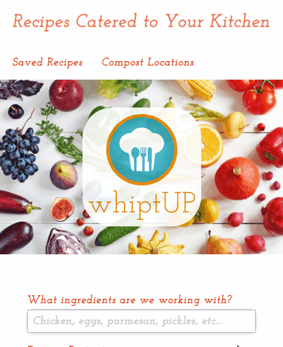
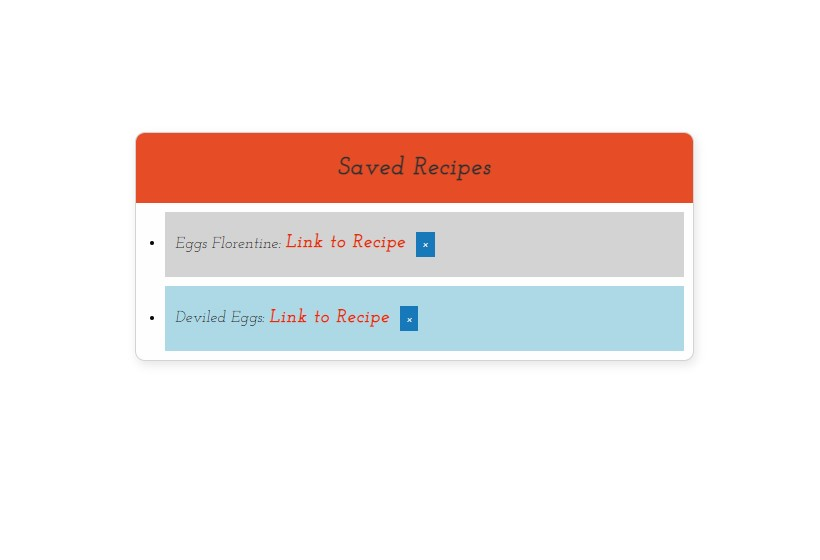
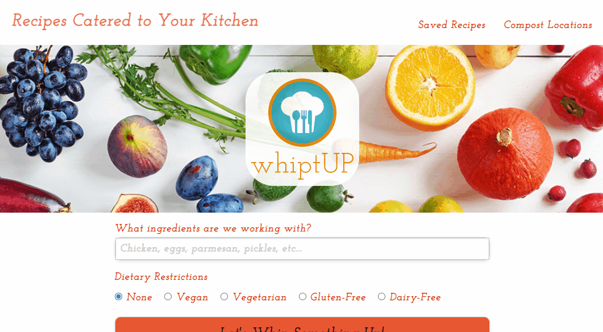

# WhiptUp
WhiptUp is a recipe generator that allows a user to input ingredients that they have on hand, and select from dietary restrictions, then recipes are generated, that include all the items that the user has selected.
WhiptUp is focused on reducing food waste so the application will provide addresses and information for food scrap drop off locations in NYC.

A link to the deployed application is available [here](https://inknsharps.github.io/WhiptUP/).

## User Story
As a environmentally conscious cook,
I want to be able to access recipes that make use of the ingredients I have on hand
So that I can reduce food waste, and also have resources on what to do with food scraps

## Demos

### Search recipes by Ingredient

### Save recipes to a list

### Search Compost Locations

## Tech/framework used
- HTML
- CSS
- Google fonts
- [Foundation](https://get.foundation/sites/docs/installation.html)

## Features
- Search bar where user inputs any ingredients they want to work with
- Dietary restrictions options (allow you to filter for vegan or vegetarian)
- Submit button which will generate the receipes
- In the footer there is a NYC neighborhood drop-down list
- When you select a neighborhood, a table appears with food scrap donation sites in the selected neighborhood

## API Reference
- Recipe search API [Edamam](https://developer.edamam.com/edamam-recipe-api)
- NYC Open Data [Food Scrop Drop-Off Locations in NYC](https://dev.socrata.com/foundry/data.cityofnewyork.us/if26-z6xq)

